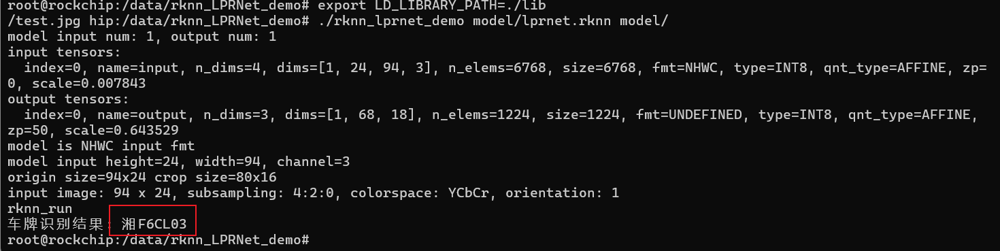

# 移远通信QSM368ZP-WF RKNN LPRNet 操作示例

#### 1 Push demo files to device

    ```shell
    adb push rknn_LPRNet_demo/ /data/
    ```

#### 2 Run demo

```sh
adb shell
cd /data/rknn_LPRNet_demo

export LD_LIBRARY_PATH=./lib
./rknn_lprnet_demo model/lprnet.rknn model/test.jpg

## 2.1 预期结果

This example will print the recognition result of license plate, as follows:
```
车牌识别结果: 湘F6CL03
