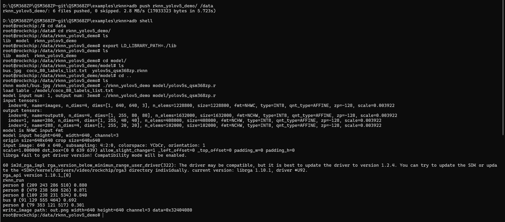
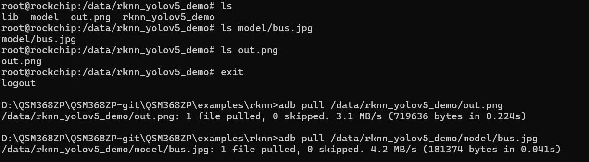
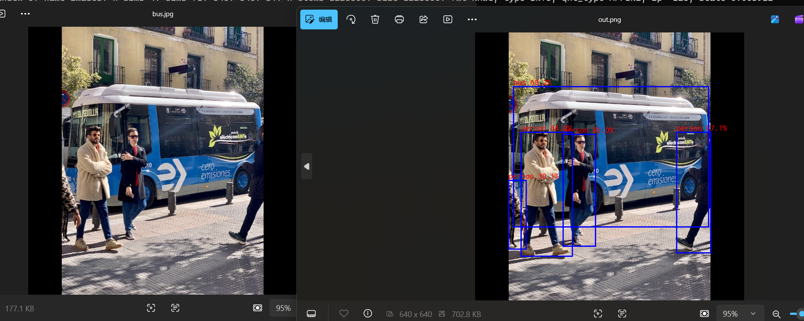

# 移远通信QSM368ZP-WF RKNN yolov5 操作示例
1. 关于RKNN详细信息请参考文档《Quectel_QSM368ZP&SC362Z-AP&SG368Z&SH603ZA_Android&Linux_RKNN_用户指导_V1.1》
    此示例为可执行程序，可以直接push到开发板中使用

2. 操作步骤如下:
    adb push rknn_yolov5_demo/ /data

    adb shell
    cd data/rknn_yolov5_demo/

    #设置依赖库环境
    export LD_LIBRARY_PATH=./lib   
    #添加执行权限
    chmod +x rknn_yolov5_demo
    #运行可执行文件:  ./rknn_yolov5_demo <model_path> <input_path>
    ./rknn_yolov5_demo model/yolov5s_relu.rknn model/bus.jpg

    

    对比前后结果：
    将图片从设备中pull到本地
    adb pull /data/rknn_yolov5_demo/out.png
    adb pull /data/rknn_yolov5_demo/model/bus.jpg
    
    
    模型运行成功