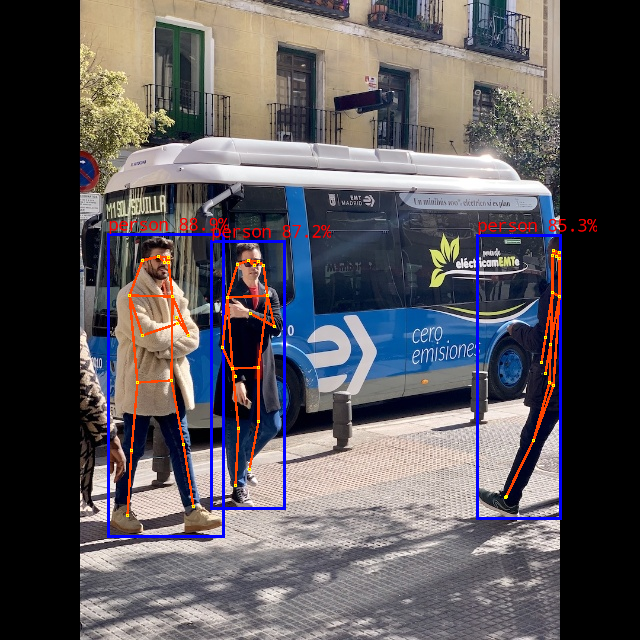

#### 1 Push demo files to device

```shell
adb push rknn_yolov8_pose_demo/ /data
```


#### 2 Run demo

```sh
adb shell
cd /userdata/rknn_yolov8_pose_demo

export LD_LIBRARY_PATH=./lib
./rknn_yolov8_pose_demo model/yolov8n-pose.rknn model/bus.jpg

- After running, the result was saved as `out.png`. To check the result on host PC, pull back result referring to the following command: 

  ```
  adb pull /userdata/rknn_yolov8_pose_demo/out.png
  ```
```


### 3. Expected Results

This example will print the labels and corresponding scores of the test image detect results, as follows:
```
person @ (209 244 286 506) 0.884
person @ (478 238 559 526) 0.868
person @ (110 238 230 534) 0.825

```
