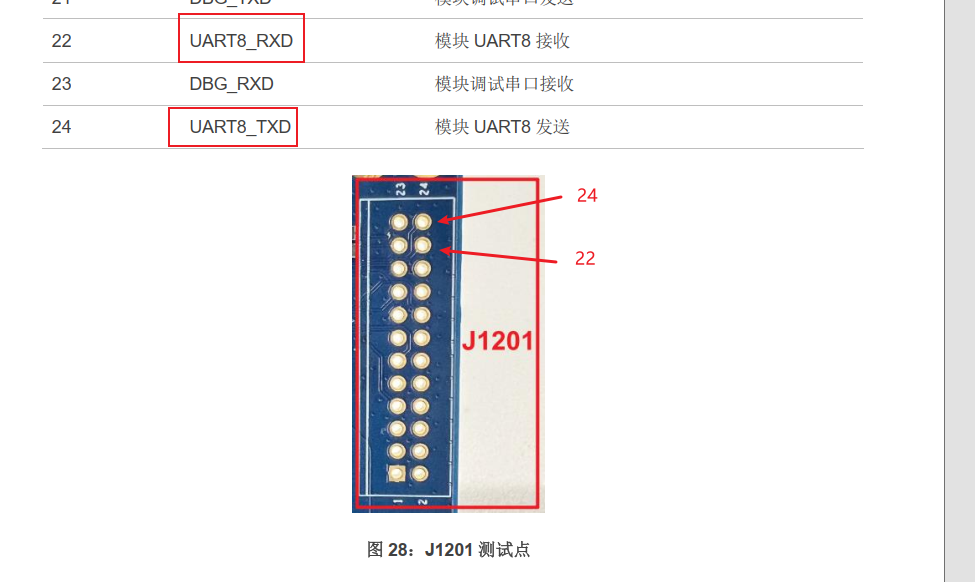
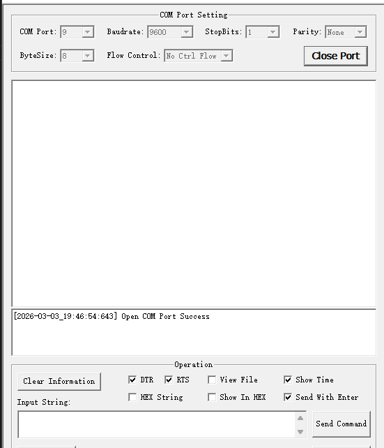
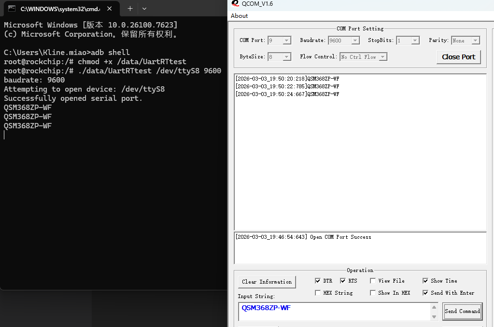

# 移远通信QSM368ZP-WF UART 操作示例
1. QSM368Z开发板留有UART的测试引脚，查看文档《Quectel_QSM368ZP-WF_用户指导_V1.0》找到UART8的测试点，引脚号为22,24，连接USB转TTL连接到电脑
 

2. 使用串口工具打开串口，UART8推荐波特率为：9600
 

 3. 编译测试程序得到可执行程序并push到设备中，此程序会打印出接收到的数据并将接收到的数据通过串口发送出去。

 4. 执行可执行程序，进行测试。 
 